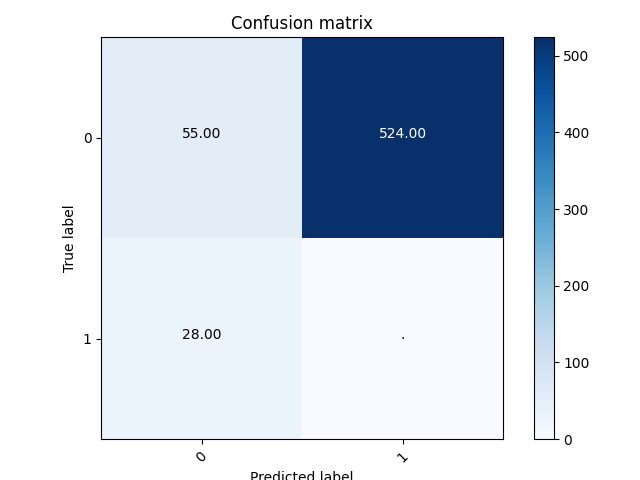
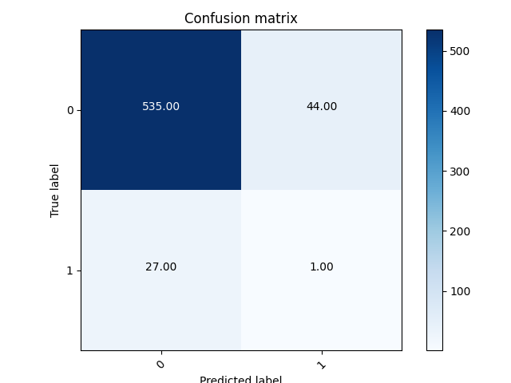
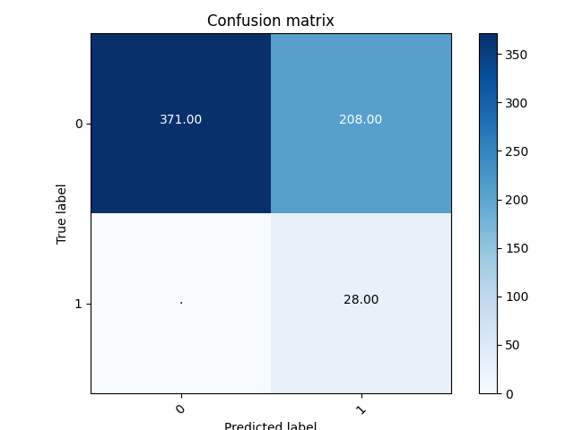

# 使用稠密连接网络提取素描图片中的特征

## 一、模型概述

### 1.1 DenseNet

在计算机视觉领域，卷积神经网络（CNN）已经成为最主流的方法。

CNN史上的一个里程碑事件是ResNet模型的出现，ResNet可以训练出更深的CNN模型，从而实现更高的准确度。ResNet模型的核心是通过建立前面层与后面层之间的“短路连接”（shortcuts，skip connection），这有助于训练过程中梯度的反向传播，从而能训练出更深的CNN网络。今天我们要介绍的是DenseNet模型，它的基本思路与ResNet一致，但是它建立的是前面所有层与后面层的密集连接（dense connection），它的名称也是由此而来。

相比ResNet，DenseNet提出了一个更激进的密集连接机制：即互相连接所有的层，具体来说就是每个层都会接受其前面所有层作为其额外的输入。图1为ResNet网络的连接机制，作为对比，图2为DenseNet的密集连接机制。可以看到，ResNet是每个层与前面的某层（一般是2~3层）短路连接在一起，连接方式是通过元素级相加。而在DenseNet中，每个层都会与前面所有层在channel维度上连接（concat）在一起（这里各个层的特征图大小是相同的，后面会有说明），并作为下一层的输入。对于一个 $L$ 层的网络，DenseNet共包含 ![[公式]](https://www.zhihu.com/equation?tex=%5Cfrac%7BL%28L%2B1%29%7D%7B2%7D) 个连接，相比ResNet，这是一种密集连接。而且DenseNet是直接concat来自不同层的特征图，这可以实现特征重用，提升效率，这一特点是DenseNet与ResNet最主要的区别。.

图1 DenseNet的网络结构
 

如果用公式表示的话，传统的网络在 ![[公式]](https://www.zhihu.com/equation?tex=l) 层的输出为：
$$
x_1 = H_l(x_{l-1})
$$
而对于ResNet，增加了来自上一层输入的identity函数：
$$
x_l=H_l(x_{l-1})+x_{l-1}
$$
在DenseNet中，会连接前面所有层作为输入：
$$
x_l = H_l([x_0,x_1,...,x_{l-1}])
$$
其中，上面的 ![[公式]](https://www.zhihu.com/equation?tex=H_l%28%5Ccdot%29) 代表是非线性转化函数（non-liear transformation），它是一个组合操作，其可能包括一系列的BN(Batch Normalization)，ReLU，Pooling及Conv操作。注意这里 ![[公式]](https://www.zhihu.com/equation?tex=l) 层与 ![[公式]](https://www.zhihu.com/equation?tex=l-1) 层之间可能实际上包含多个卷积层。

CNN网络一般要经过Pooling或者stride>1的Conv来降低特征图的大小，而DenseNet的密集连接方式需要特征图大小保持一致。为了解决这个问题，DenseNet网络中使用DenseBlock+Transition的结构，其中DenseBlock是包含很多层的模块，每个层的特征图大小相同，层与层之间采用密集连接方式。而Transition模块是连接两个相邻的DenseBlock，并且通过Pooling使特征图大小降低。图4给出了DenseNet的网路结构，它共包含4个DenseBlock，各个DenseBlock之间通过Transition连接在一起。

在DenseBlock中，各个层的特征图大小一致，可以在channel维度上连接。DenseBlock中的非线性组合函数 ![[公式]](https://www.zhihu.com/equation?tex=H%28%5Ccdot%29) 采用的是**BN+ReLU+3x3 Conv**的结构，如图6所示。另外值得注意的一点是，与ResNet不同，所有DenseBlock中各个层卷积之后均输出 ![[公式]](https://www.zhihu.com/equation?tex=k) 个特征图，即得到的特征图的channel数为 ![[公式]](https://www.zhihu.com/equation?tex=k) ，或者说采用 ![[公式]](https://www.zhihu.com/equation?tex=k) 个卷积核。 ![[公式]](https://www.zhihu.com/equation?tex=k) 在DenseNet称为growth rate，这是一个超参数。一般情况下使用较小的 ![[公式]](https://www.zhihu.com/equation?tex=k) （比如12），就可以得到较佳的性能。假定输入层的特征图的channel数为 ![[公式]](https://www.zhihu.com/equation?tex=k_0) ，那么 ![[公式]](https://www.zhihu.com/equation?tex=l) 层输入的channel数为 ![[公式]](https://www.zhihu.com/equation?tex=k_0%2Bk%28l-1%29) ，因此随着层数增加，尽管 ![[公式]](https://www.zhihu.com/equation?tex=k) 设定得较小，DenseBlock的输入会非常多，不过这是由于特征重用所造成的，每个层仅有 ![[公式]](https://www.zhihu.com/equation?tex=k) 个特征是自己独有的。

在DenseBlock中，各个层的特征图大小一致，可以在channel维度上连接。DenseBlock中的非线性组合函数 ![[公式]](https://www.zhihu.com/equation?tex=H%28%5Ccdot%29) 采用的是**BN+ReLU+3x3 Conv**的结构，如图6所示。另外值得注意的一点是，与ResNet不同，所有DenseBlock中各个层卷积之后均输出 ![[公式]](https://www.zhihu.com/equation?tex=k) 个特征图，即得到的特征图的channel数为 ![[公式]](https://www.zhihu.com/equation?tex=k) ，或者说采用 ![[公式]](https://www.zhihu.com/equation?tex=k) 个卷积核。 ![[公式]](https://www.zhihu.com/equation?tex=k) 在DenseNet称为growth rate，这是一个超参数。一般情况下使用较小的 ![[公式]](https://www.zhihu.com/equation?tex=k) （比如12），就可以得到较佳的性能。假定输入层的特征图的channel数为 ![[公式]](https://www.zhihu.com/equation?tex=k_0) ，那么 ![[公式]](https://www.zhihu.com/equation?tex=l) 层输入的channel数为 ![[公式]](https://www.zhihu.com/equation?tex=k_0%2Bk%28l-1%29) ，因此随着层数增加，尽管 ![[公式]](https://www.zhihu.com/equation?tex=k) 设定得较小，DenseBlock的输入会非常多，不过这是由于特征重用所造成的，每个层仅有 ![[公式]](https://www.zhihu.com/equation?tex=k) 个特征是自己独有的。

对于Transition层，它主要是连接两个相邻的DenseBlock，并且降低特征图大小。Transition层包括一个1x1的卷积和2x2的AvgPooling，结构为**BN+ReLU+1x1 Conv+2x2 AvgPooling**。另外，Transition层可以起到压缩模型的作用。假定Transition的上接DenseBlock得到的特征图channels数为 ![[公式]](https://www.zhihu.com/equation?tex=m) ，Transition层可以产生 ![[公式]](https://www.zhihu.com/equation?tex=%5Clfloor%5Ctheta+m%5Crfloor) 个特征（通过卷积层），其中 ![[公式]](https://www.zhihu.com/equation?tex=%5Ctheta+%5Cin+%280%2C1%5D) 是压缩系数（compression rate)。

图2 DenseNet对图片的预测过程
 

本文使用了DenseNet121来提取素描图片的特征。

### 1.2 学习率变化

学习率的调整在训练的过程中很重要，通常情况下随着训练的进行，模型的参数值逐渐趋于收敛，学习率会越来越小。即使如此，学习率的衰减速率的变化也是会有所不同，对于一些特殊的任务我们更是希望能以一些比较特别的方式甚至自己定义的方式来调节学习率。

以随机梯度下降（SGD）算法为例，每次从训练数据中随机选择一批样本，样本数为Batch Size。很多实验都证明了，在LR不变的情况下，Batch Size越大，模型收敛效果越差。在训练时，我们实际发现，模型在批量较大时，容易产生梯度消失的问题。

为此，我们引入了学习率变化机制，使得解函数能够在梯度中不断前进，最终能够尽可能的达到最优解。

## 二、实验结果
### 2.1 混淆矩阵
如下为各个属性的混淆矩阵，若矩阵中的元素为.，其等同于**元素值为0**

图3 earring属性的混淆矩阵
 

图4 frontal_face属性的混淆矩阵
 

图5 smile属性的混淆矩阵
 

图6 style属性的混淆矩阵
 

### 2.2 预测准确度
|  属性   |   AP  |
|  ----  | ----  |
| earring  | 0.934 |
| frontal_face  | 0.891 |
| smile  | 0.862 |
| style  | 0.510 |
| mAP  | 0.798 |
## 参考文献

1. [2017 CVPR] DenseNet [Densely Connected Convolutional Networks]